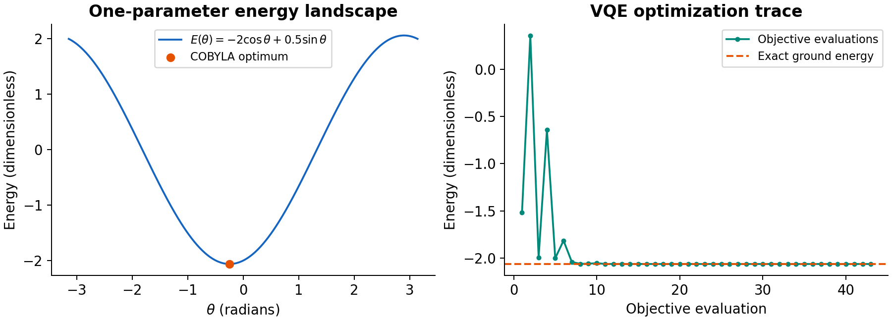

# Qiskit Practice

These notebooks started as exercises while I was learning Qiskit. They cover circuit construction, quantum states, measurement, a small VQE calculation, and transpilation. The repository also includes numerical checks and saved plots.

The examples use Python, Qiskit, NumPy, SciPy, and Matplotlib. Everything runs on a local simulator.

## Notebooks

| Notebook | Contents |
| --- | --- |
| [01 — Circuits and primitives](notebooks/01_circuits_and_primitives.ipynb) | Basic gates, Bell and GHZ states, parameterized rotations, and the difference between Sampler and Estimator |
| [02 — VQE](notebooks/02_vqe_ground_state.ipynb) | A two-qubit ground-state calculation using a parameterized circuit and COBYLA, compared with exact diagonalization |
| [03 — Evolution and transpilation](notebooks/03_evolution_and_transpilation.ipynb) | Hamiltonian time evolution, Trotter approximation error, and circuit depth and gate counts at optimization levels 0–3 |

Each notebook can be run separately. The saved outputs let you read the results directly on GitHub.

## VQE example

The VQE notebook uses the Hamiltonian

$$H=-Z_0-Z_1+0.5X_0X_1.$$

The trial circuit has an $R_y(\theta)$ rotation followed by a CX gate. COBYLA adjusts the angle to minimize the energy, evaluated from the simulated statevector.

| Result | Value |
| --- | --- |
| Optimal angle | approximately −0.244979 radians |
| VQE energy | −2.0615528128 |
| Exact ground-state energy | −2.0615528128 |
| Absolute energy error | below $10^{-8}$ |



The third notebook compares exact time evolution with a Lie-Trotter approximation. It then compiles a fixed circuit into `rz`, `sx`, `x`, and `cx` gates and checks that transpilation preserves its unitary, up to global phase.

## Run the notebooks

The project was checked with Python 3.12 and Qiskit 2.5.2. From the project folder, create and activate an environment:

**Windows PowerShell**

```powershell
py -3.12 -m venv .venv
.venv\Scripts\Activate.ps1
```

**macOS or Linux**

```bash
python3.12 -m venv .venv
source .venv/bin/activate
```

Then install the dependencies and open JupyterLab:

```bash
python -m pip install -r requirements.txt
python -m ipykernel install --user --name qiskit-portfolio --display-name "Qiskit Portfolio"
jupyter lab
```

Select the **Qiskit Portfolio** kernel when opening a notebook, then run the cells in order.

## Code and results

- `src/qiskit_portfolio/` contains the experiment functions and a script to generate the results.
- `results/` contains plots, CSV tables, and a JSON summary with parameters and package versions.
- `tests/` checks the states, expectation values, VQE result, evolution, and transpilation against analytical or matrix references.

To regenerate the plots and numerical results:

```bash
python -m qiskit_portfolio.demo --output-dir results
```

To run the nine reference tests:

```bash
python -m unittest discover -s tests -v
```

## About the examples

This is a learning project with small, ideal simulations. The VQE uses exact expectation values; the Bell and GHZ examples sample a finite number of shots. Hamiltonian coefficients and time are dimensionless, with $\hbar=1$.

The transpilation comparison uses a gate basis without a device coupling map or noise model. The one-parameter VQE circuit works for the Hamiltonian above; other problems may need a different ansatz.

## References

- [Qiskit bit ordering](https://quantum.cloud.ibm.com/docs/en/guides/bit-ordering)
- [StatevectorSampler](https://quantum.cloud.ibm.com/docs/en/api/qiskit/qiskit.primitives.StatevectorSampler)
- [StatevectorEstimator](https://quantum.cloud.ibm.com/docs/en/api/qiskit/qiskit.primitives.StatevectorEstimator)
- [PauliEvolutionGate](https://quantum.cloud.ibm.com/docs/en/api/qiskit/qiskit.circuit.library.PauliEvolutionGate)
- [Transpiler optimization levels](https://quantum.cloud.ibm.com/docs/en/guides/set-optimization)
