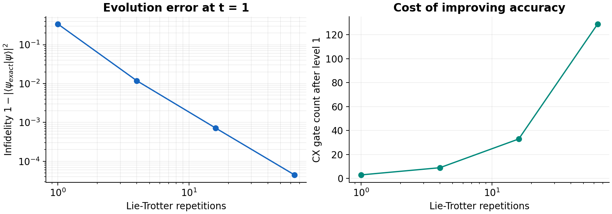

# Qiskit Quantum Computing Portfolio

A reproducible learning project connecting quantum circuits to a two-qubit variational ground-state calculation, Hamiltonian time evolution, and circuit compilation.

The notebooks explain the physics, show the code, and compare the results with analytical or exact matrix references. Saved outputs and figures make the project readable without running it.

**Tools:** Python · Qiskit 2.5.2 · NumPy · SciPy · Matplotlib · Jupyter

## Start with the notebooks

| Notebook | Main question | Skills demonstrated |
| --- | --- | --- |
| [01 · Circuits and primitives](notebooks/01_circuits_and_primitives.ipynb) | How do circuit operations become states, measurement outcomes, and expectation values? | Basic gates, Bell/GHZ states, parameter binding, V2 Sampler/Estimator, Pauli operators, bit ordering |
| [02 · VQE ground state](notebooks/02_vqe_ground_state.ipynb) | Can a parameterized circuit find the ground state of an interacting Hamiltonian? | Variational ansatz, classical COBYLA optimization, energy landscape, exact diagonalization, state fidelity |
| [03 · Evolution and transpilation](notebooks/03_evolution_and_transpilation.ipynb) | How do evolution accuracy and gate cost change when the circuit is synthesized and compiled? | Explicit Lie-Trotter synthesis, matrix-exponential reference, optimization levels 0–3, depth/CX counts, unitary checks |

The notebooks run independently after installation. Reading them in this order follows the learning progression.

## Main experiment: validate a small VQE

The Hamiltonian is

$$H=-Z_0-Z_1+0.5X_0X_1.$$

The trial circuit applies an $R_y(\theta)$ gate to qubit 0 and a CX gate from qubit 0 to qubit 1, preparing

$$|\psi(\theta)\rangle=\cos(\theta/2)|00\rangle+\sin(\theta/2)|11\rangle.$$

Its energy is $E(\theta)=-2\cos\theta+0.5\sin\theta$. A classical optimizer adjusts the angle using exact statevector expectations. The result is checked against the eigenvalues and eigenvectors of the full Hamiltonian matrix.


| Quantity | Result in the checked run |
| --- | --- |
| Optimal angle | approximately −0.24497865 radians |
| VQE ground-state energy | −2.0615528128 |
| Exact ground-state energy | $-\sqrt{4.25}$, approximately −2.0615528128 |
| Absolute energy error | below $10^{-8}$ |
| Ground-state fidelity | above 0.99999999 |

The single-parameter ansatz succeeds because this Hamiltonian's ground state lies in its real, even-parity family. This result does not imply that the ansatz will solve an arbitrary two-qubit problem.

## Evolution accuracy and compilation cost

`PauliEvolutionGate` represents $\exp(-itH)$, but its synthesis can approximate that operation. This project explicitly synthesizes the gate before assessing the circuit, so an exact-matrix evaluation cannot hide the product-formula error.



At $t=1$, increasing Lie-Trotter repetitions from 1 to 64 reduces this initial state's infidelity from approximately **0.340** to **0.0000447**. At the fixed level-1 compilation setting, the CX count increases from **3** to **129**. The dense matrix exponential supplies a reference for this small example.

For a separate, fixed four-step synthesized circuit, optimization levels 0–3 are compared in the same gate basis. In the checked run, depth decreases from **46** at level 0 to **13** at level 3, and CX count from **9** to **2**. Each compiled circuit is checked for complete unitary equivalence to the synthesized input, up to global phase. This check preserves the chosen approximation; it does not remove the approximation error.

Higher optimization levels are not guaranteed to improve every circuit. These counts describe this example and software environment.

## Run locally

The checked run used **Python 3.12.14**. Python 3.12 is recommended. Run the following commands from the project folder; a dedicated environment keeps the dependencies separate from other research software.

**Windows PowerShell:**

```powershell
py -3.12 -m venv .venv
.venv\Scripts\Activate.ps1
python -m pip install -r requirements.txt
python -m ipykernel install --user --name qiskit-portfolio --display-name "Qiskit Portfolio"
jupyter lab
```

If PowerShell blocks activation, open Command Prompt and use `.venv\Scripts\activate.bat` instead.

**macOS / Linux:**

```bash
python3.12 -m venv .venv
source .venv/bin/activate
python -m pip install -r requirements.txt
python -m ipykernel install --user --name qiskit-portfolio --display-name "Qiskit Portfolio"
jupyter lab
```

Open a notebook, select the **Qiskit Portfolio** kernel, and use **Restart Kernel → Run All**. All examples use local simulation and require no IBM Quantum account or API token.

## Reproduce the results and run the checks

```bash
# Regenerate four plots, CSV tables, and the JSON result summary.
python -m qiskit_portfolio.demo --output-dir results

# Check analytical predictions, exact references, and unitary equivalence.
python -m unittest discover -s tests -v

# Execute notebooks in fresh Jupyter kernels and write their outputs.
python tools/execute_notebooks.py
```

The nine reference tests passed in the checked environment. All notebook code cells were also executed in separate, fresh Python/IPython processes to validate their code and produce the saved outputs. The included [GitHub Actions workflow](.github/workflows/checks.yml) runs the tests, fresh-kernel notebook execution, and output regeneration on pushes and pull requests; its first hosted run occurs after upload.

The direct scientific dependency versions are pinned in [pyproject.toml](pyproject.toml); transitive dependencies are not fully locked. Sampling seeds are 42 for Bell and 43 for GHZ, and the transpiler seed is 42. Seeds aid reproducibility within a software environment; optimizer traces and compiled circuits can still change across versions or platforms.

## Repository contents

| Path | Purpose |
| --- | --- |
| `notebooks/` | Three annotated notebooks with executed outputs |
| `src/qiskit_portfolio/experiments.py` | Reusable circuit construction, VQE, evolution, and compilation functions |
| `src/qiskit_portfolio/demo.py` | Command-line reproduction of plots and numerical results |
| `tests/test_experiments.py` | Nine tests grounded in independent quantum predictions |
| `results/summary.json` | Numerical results, seeds, and scientific package versions |
| `results/*.csv` | Objective-evaluation trace and benchmark tables |
| `results/figures/` | Four figures used to explain the results |
| `tools/execute_notebooks.py` | Fresh-kernel notebook execution |

## Scope and learning provenance

This is an educational portfolio developed from my guided Qiskit crash-course practice with ChatGPT. The original exercises covered circuit construction, primitives, parameterized states, a small VQE, time evolution, and transpilation. Repository organization, explanatory text, reusable functions, exact-reference checks, the synthesis comparison, plots, and automation were added with AI assistance when preparing the project for sharing.

All results are ideal local simulations. Hamiltonian coefficients and time use dimensionless units with $\hbar=1$. The VQE cost has no shot noise; the sampling examples have finite-shot randomness but no device noise. The compilation example has no backend coupling map, calibration, or gate-duration model. Dense diagonalization and full-unitary checks are practical here because the system has only two qubits. This project demonstrates foundational Qiskit workflows and does not claim hardware execution or quantum advantage.

Possible future extensions include finite-shot energy estimation, a noise model, a richer ansatz, or compilation for a specified hardware topology.

## References

- [Qiskit bit ordering](https://quantum.cloud.ibm.com/docs/en/guides/bit-ordering)
- [StatevectorSampler](https://quantum.cloud.ibm.com/docs/en/api/qiskit/qiskit.primitives.StatevectorSampler)
- [StatevectorEstimator](https://quantum.cloud.ibm.com/docs/en/api/qiskit/qiskit.primitives.StatevectorEstimator)
- [PauliEvolutionGate](https://quantum.cloud.ibm.com/docs/en/api/qiskit/qiskit.circuit.library.PauliEvolutionGate)
- [LieTrotter](https://quantum.cloud.ibm.com/docs/en/api/qiskit/qiskit.synthesis.LieTrotter)
- [Transpiler optimization levels](https://quantum.cloud.ibm.com/docs/en/guides/set-optimization)
